# HW3
Часть I.AntCont
1) устаревшие слова
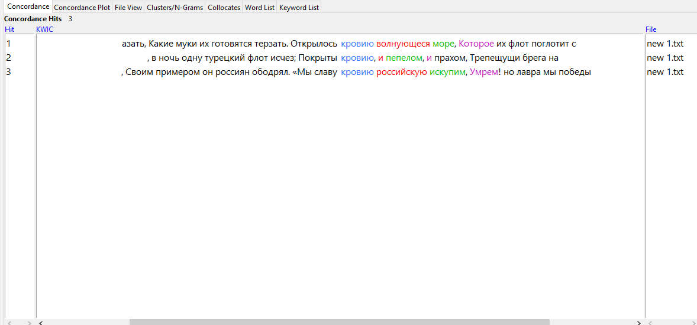
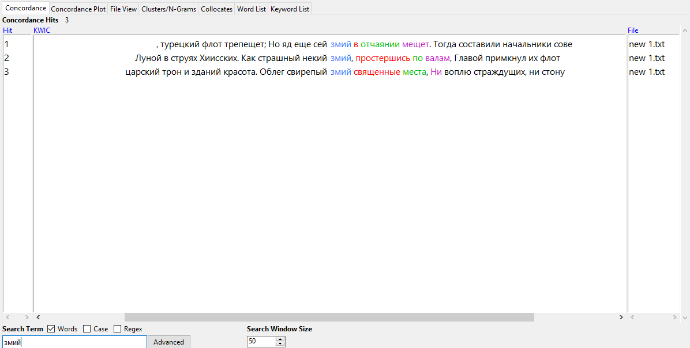
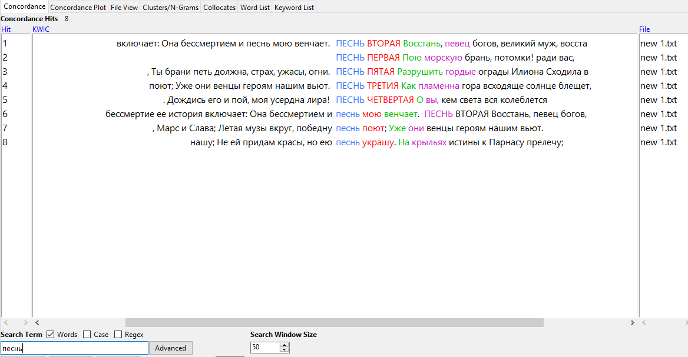
2) со стоп-словами
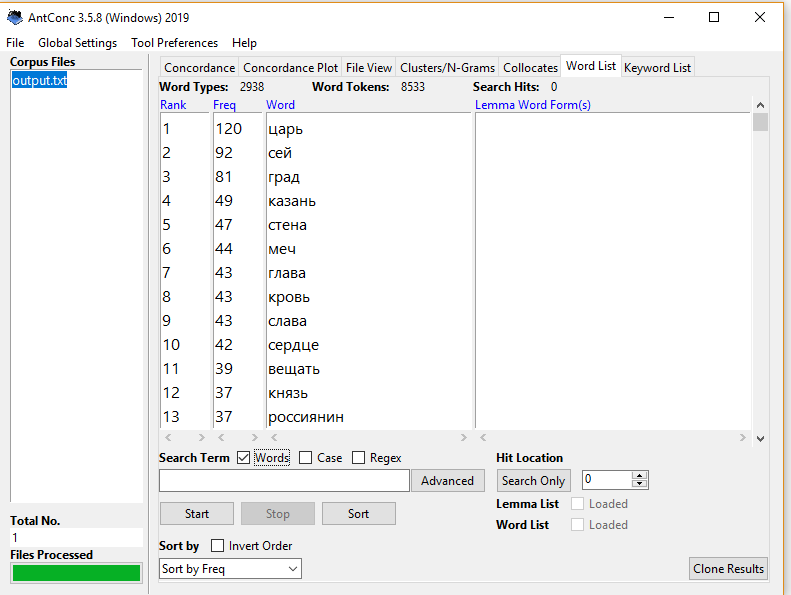
3) без стоп-слов
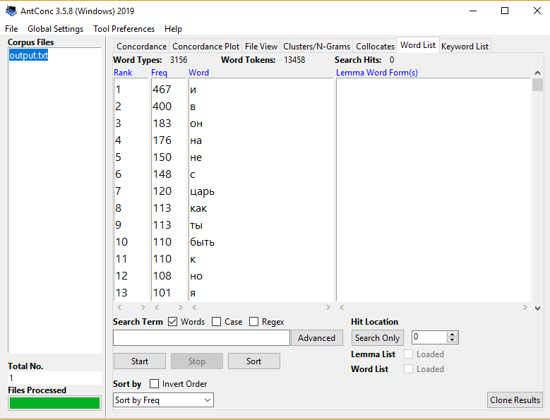

4)n-grams

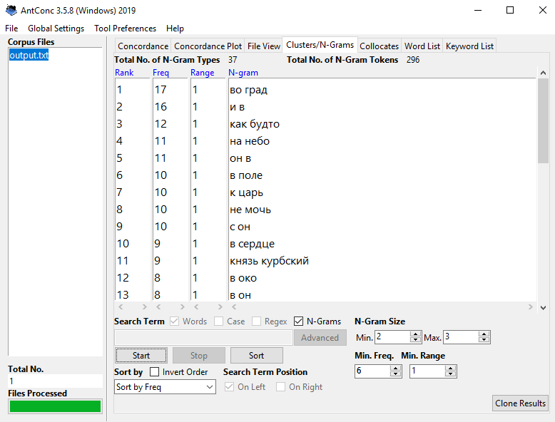
5) collocates
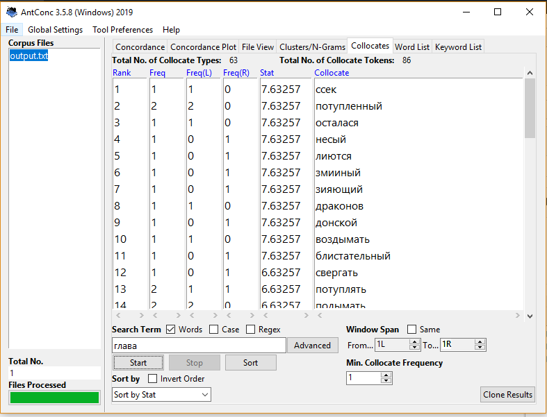

Часть II.Google Ngrams и НКРЯ
Устаревшие слова из моего отрывка: глас, чадо, рачение, паства, паче, пагуба, перси, вран, препона
1) Глас 
ipm= 9,19

Современный аналог - голос

В НКРЯ: глас - 2604 вхождения (впервые - И. А. Желябужский. Дневные записки (1682-1709)); голос - 139239 вхождений(впервые - А. М. Макаров (ред.). Гистория Свейской войны (Поденная записка Петра Великого) (1698-1721)). 
Мы видим, что полногласный аналог,начал употребляться чуть позже, однако, сумел вытеснить устаревший вариант, став более употребительным.

В Google Ngrams:
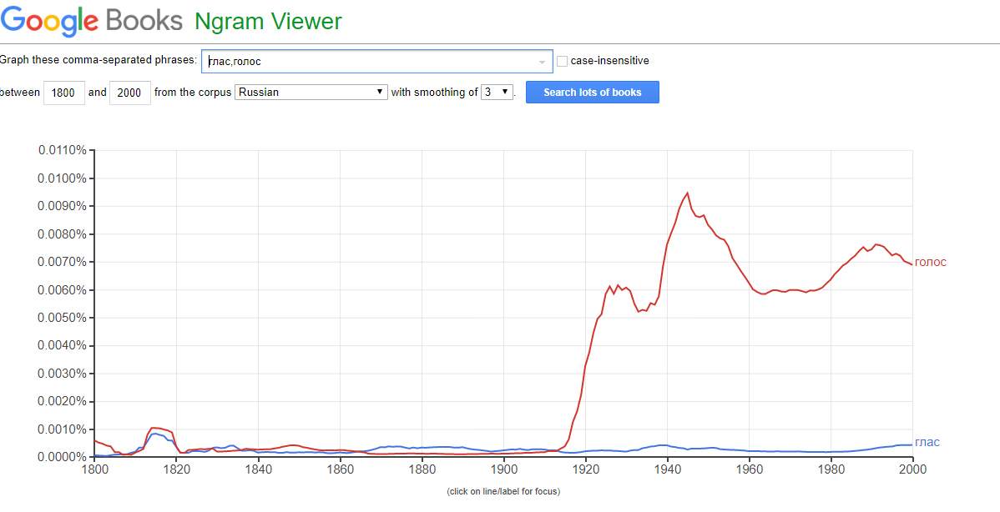

Мы видим, что в некоторые периоды "глас" был более употребителен, чем голос, тем не менее, современный вариант все-таки намного превышает по употребительности.

2) Чадо

ipm= 12,16

Современный аналог - ребенок

В НКРЯ: чадо -3447 вхождений (впервые -архиепископ Феофан (Прокопович). Пролог к слышателем (1705))   , ребенок – 173845 вхождений (впервые -И. А. Желябужский. Дневные записки (1682-1709))
Мы видим, что слово "ребенок", уоптребляемое в современном русском языке,упоминается в более ранних текстах, нежели "чадо",однако именно "ребенок" стал чаще употребляться и сохранился в сегодняшней речи.

В Google Ngrams:
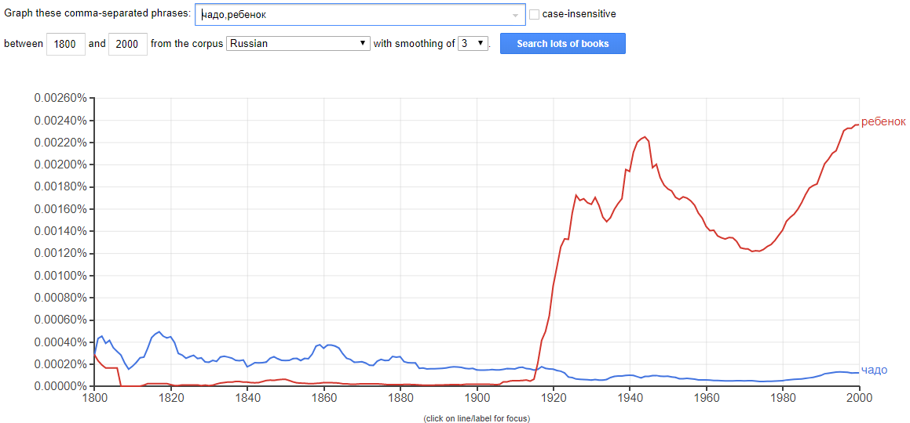

Мы видим, что до начала 20века "чадо" было более употребительным, в отличие от "ребенка" однако с начала 20 века картина кардинально изменилась в противоположную сторону.

3) Рачение

 ipm- 0,75

Современный аналог - усердие

В НКРЯ: рачение -212 вхождений (впервые -М. В. Ломоносов. Свидетельства о науках советника Ломоносова (1739-1764))   , усердие– 4342 вхождения (впервые -архиепископ Феофан (Прокопович). Пролог к слышателем(1705) )
Мы видим, что слово "усердие", уоптребляемое в современном русском языке,упоминается в более ранних текстах, нежели "рачение",однако именно "усердие" стало чаще употребляться и сохранился в сегодняшней речи.

В Google Ngrams:
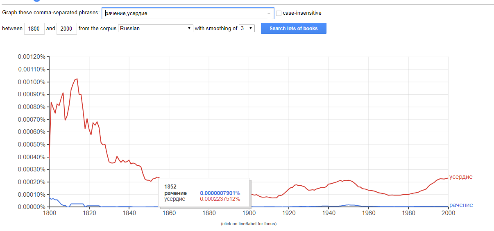

Мы видим, что "рачение" было очень малоупотребительным словом на протяжении всего периода, в отличие от "усердия", пик употребления которого пришелся на начало 19 века.

4) Паства

 ipm- 4,9

Современный аналог - пастбище

В НКРЯ: паства -1389 вхождений (впервые -В. Н. Татищев. Мнение об управлении юртовскими татарами и о разверстании земель между ними (1745)) , пастбище– 1306 вхождения (впервые - Краткое наставленіе Какимъ образомъ скотской падежъ отвращать (1773))

Мы видим, что слово "паства", впервые вошло в текст более раннего периода, нежели аналог "пастбище", при этом общее количество вхождений обоих слов не сильно отличается.

В Google Ngrams:
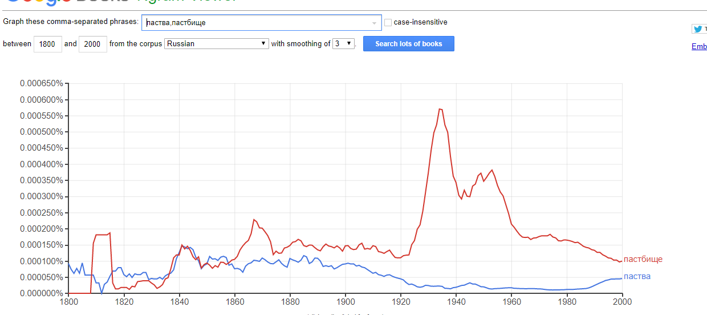

Мы видим, что "паства" появилось раньше, и даже после возникновения "пастбища" в некоторых периодах было более употребительным, однако с середины 19 века "пастбище" вытеснило его.

5) Паче

 ipm- 14,13

Современный аналог - больше

В НКРЯ: паче-4006 вхождений (впервые - И. А. Желябужский. Дневные записки (1682-1709) ) , больше– 189647 вхождения (впервые - И. А. Желябужский. Дневные записки (1682-1709))

Мы видим, что слова "паче" и " больше" упервые вошли в один и тот же текст, однако современный аналог стал более употребительным.

В Google Ngrams:
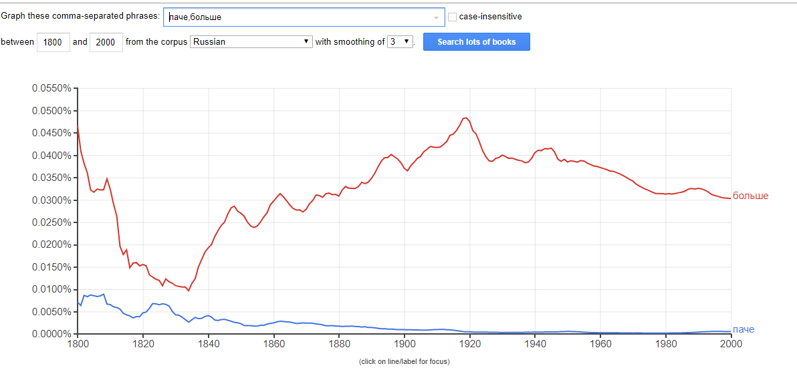

Мы видим, что "паче" на протяжении всего периода было менее употребительно, нежели "больше".

6) Пагуба

 ipm- 1,245

Современный аналог - погибель

В НКРЯ: пагуба-353 вхождения (впервые - А. М. Макаров (ред.). Гистория Свейской войны (Поденная записка Петра Великого) (1698-1721)  ) , погибель– 2817 вхождения (впервые - И. А. Желябужский. Дневные записки (1682-1709))

Мы видим, что слова "пагуба" впервые вошло в текст немного позже, чем "погибель", однако "погибель" осталось в современном языке.

В Google Ngrams:
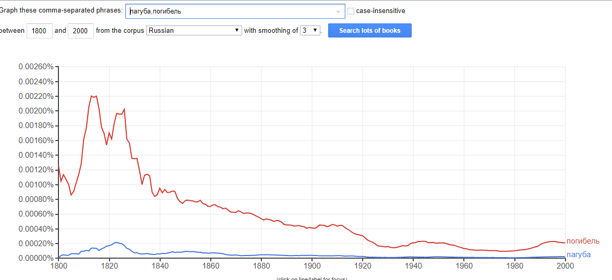

Мы видим, что "пагуба" на протяжении всего периода было менее употребительно, нежели "погибель".

7) Перси

 ipm- 1,72

Современный аналог - грудь

В НКРЯ: перси-488 вхождения (впервые - архиепископ Феофан (Прокопович). Слово похвальное о преславной над войсками свейскими победе, пресветлейшему государю царю и великому князю Петру Алексиевичу (1709) ) , грудь– 45287  вхождения (впервые - А. М. Макаров (ред.). Гистория Свейской войны (Поденная записка Петра Великого) (1698-1721) )

Мы видим, что слова "перси" впервые вошло в текст немного позже, чем "грудь", однако "грудь" осталось в современном языке.

В Google Ngrams:
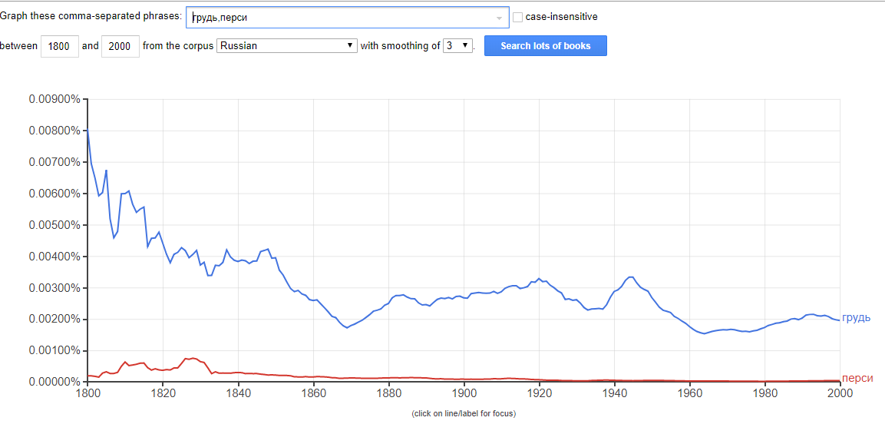

Мы видим, что "перси" на протяжении всего периода было менее употребительно, нежели "грудь".

8) Вран

 ipm- 0,31

Современный аналог - ворон

В НКРЯ: вран-88 вхождения (впервые - архиепископ Феофан (Прокопович). Слово похвальное в день Святыя великомученицы Екатерины, на тезоименитство благоверныя государыни Екатерины... (1717)) , ворон– 6841  вхождение (впервые - В. Н. Татищев. Письмо Я. В. Брюсу (1720))

Мы видим, что слова "вран" впервые вошло в текст немного раньше, чем "ворон", которое и осталось в современном языке.

В Google Ngrams:
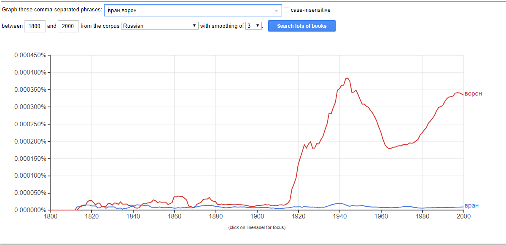

Мы видим, что слово "вран" появилось раньше полногласного варианта, но было молоупотребительным на протяжении всего периода, в отличие от "ворона".
 

9) Препона

 ipm- 1,8

Современный аналог - препятствие

В НКРЯ: препона- 513 вхождения (впервые -  Таможенный тариф 1724 года (1723)) , препятствие– 8740  вхождение (впервые - А. М. Макаров (ред.). Гистория Свейской войны (Поденная записка Петра Великого) (1698-1721))

Мы видим, что слова "препона" впервые вошло в текст немного позже, чем "препятствие", которое и осталось в современном языке.

В Google Ngrams:
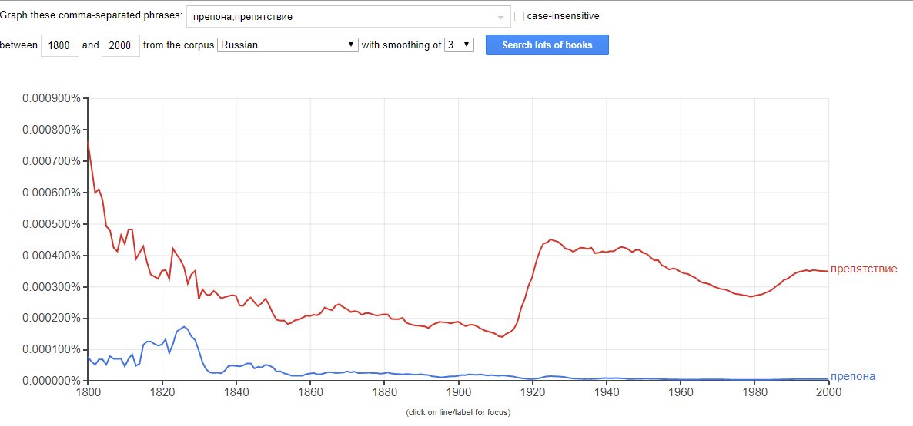

Мы видим, что слово "препона" на протяжении всего периода было менее употребительно чем "препятствие".

